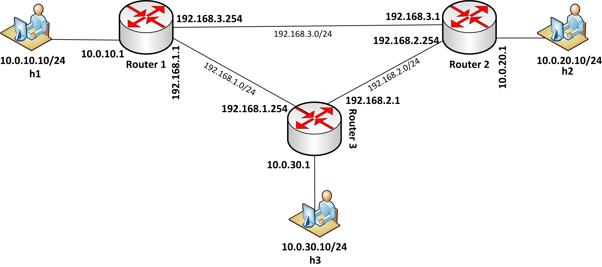

### Introduction ###

This demo shows how to implement a basic IP routers with static routing entries using P4, BMv2 and Mininet. 

The basic functionality of IP router is:

- determine the output port for packet based on destination IP (Longest Prefix Match)
- decrement TTL value for IP protocol
- update destination MAC address based on next-hop IP address
- update source MAC address according to output port

We have implemented the functionality of IP router as P4 program (router.p4). The program design is as follows:

- We have used V1Model of P4_16 composed of Ingress and Egress control pipelines
- For Ingress control pipeline there is one table defined:
  - **routing_table** - it determines the output port based on IPv4 LPM. When packet is matched the *ipv4_forward* action is invoked. It sets next-hop IP address in the routing_metadata, decrements IPv4 TTL and sets output port.
- For Egress control pipeline we have defined two tables:
  - **switching_table** - it is responsible for setting destination MAC based on next-hop IP address, which is retrieved from routing metadata.
  - **mac_rewriting_table** - it updates source MAC address according to the output port for the packet.

The router.p4 program defines the data plane of IP routers. Note that the control plane in this demo is realized by populating static rules.

The structure of the test network is shown below. Each network device has been configured with the **router.p4** program. 

  

### Demo ###

1. First of all you need to setup the environment on your Linux machine.
2. Enter the ip-routing/ directory.

`cd ip-routing/`

3. Run the Mininet topology.

`sudo python topo.py --behavioral-exe simple_switch --json p4include/router.json`

4. In the Mininet console, check if ping between h1 and h2 works (it shouldn't!)

`h1 ping h2`

5. As expected ping doesn't work, because the static rules weren't populated by control plane. Populate static rules manually by invoking:

`./install_flow_rules.sh`

6. You should see that rules have been installed on the switches. Run ping again:

`h1 ping h2`

`pingall`

7. Communication between hosts should work properly.

### Conclusions & next steps ###

This demo presents how to implement IP routers using P4. I encourage you to analyze how the router.p4 program has been implemented and try to implement your own from scratch.

The P4 and Mininet provides nice tools to make network prototypes.

As the next step it would be challanging to implement some control-plane operations like OSPF dynamic routing or L2 link discovery based on the LLDP protocol. 

