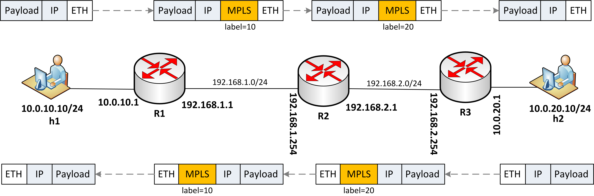

## Introduction ##

This demo shows how to implement a basic MPLS network using P4, BMv2 and Mininet. 

## Design of the P4 program ##

MPLS (Multiprotocol Label Switching) is a standard to simplify IP forwarding. Devices implementing MPLS is called Label
Switching Router (LSR). LSRs use label to set up MPLS tunnel. The basic set of LSR's functionalities consists of:

- **FEC (Forwarding Equivalence Class) classifier**, which classifies packets into different classes and binds a label to particular class of packets.
- **Label operations**:
  - **Push a label** - add the MPLS header to a packet
  - **Swap a label** - change a value of MPLS label
  - **Pop a label** - remove the MPLS header from a packet
- **Label-based forwarding** - LSR determines the output port for a packet based on the input port and MPLS label.

Besides, LSR must implement also IP lookup to forward non-MPLS packets (or when the MPLS header is stripped out) and MAC-level switching.
To know more about MPLS visit [this site](http://www.csc.kth.se/utbildning/kth/kurser/DD2490/ipro1-10/lectures/MPLS.pdf). 

The functionality of LSR has been implemented as the P4 program (mpls.p4). For the sake of portability to PISCES 
we have implemented the program in P4_14. The program design is as follows (5 match-action tables in order):

- **fec_table** - it implements a functionality of FEC classifier. We assume classification based on destination IP address (LPM),
but the classification could be more granular. If a packet is classified, the *push_mpls()* method is invoked to add the MPLS header.
- **mpls_table** - this table is used by transit or egress LSR. It determines to swap or pop the MPLS label based on the input port and MPLS label.
- **mplslookup_table** - it forwards a packet to an output port based on the MPLS label (if exists).
- **iplookup_table** - if the MPLS label doesn't exists (it's pure IP packet or MPLS label has been stripped out in the *mpls_table*) it performs IP lookup to determine the output port.
- **switching_table** - it rewrites source and destination MAC addresses (per-hop behaviour).

## Demo ##

If you want to test the demo in practice check the mpls.p4 program out and reproduce following steps.

### Network topology ###

  

### User guide ###

1. First of all you need to setup the environment on your Linux machine.
2. From mpls/ directory run the Mininet topology with MPLS program.

`sudo python topo.py --behavioral-exe simple_switch --json p4include/mpls.json`

4. In the Mininet console, check if ping between h1 and h2 works (it shouldn't!)

`h1 ping h2`

5. As expected ping doesn't work, because the static rules weren't populated by control plane. Populate static rules manually by invoking:

`./install_flow_rules.sh`

6. You should see that rules have been installed on the switches. Run ping again:

`h1 ping h2`

`pingall`

7. Communication between hosts should work properly. You can run tcpdump on s1-eth1, s1-eth2, s2-eth2, s2-eth1 to check how MPLS has been handled on the path/

## Conclusions ##

This demo shows how MPLS could be implemented in P4. I encourage you to analyze how the mpls.p4 program has been implemented and try to implement your own from scratch.

It gives a clear understanding how MPLS network works and, additionaly, how simple is to implement MPLS in P4. 
